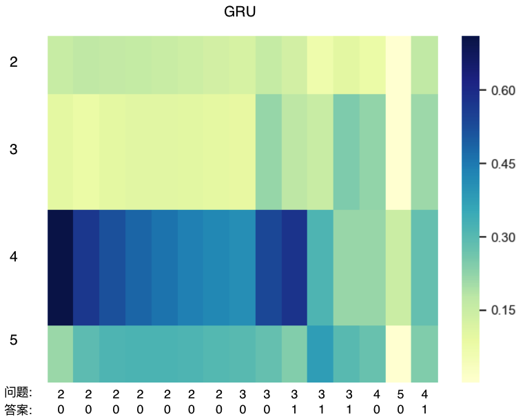

# DKT

## Requirements
python3, numpy, pandas, scikit-learn, seaborn, mxnet
## DKVMN
Based on the paper: **Dynamic Key-Value Memory Networks for
Knowledge Tracing**
Source code: https://github.com/jennyzhang0215/DKVMN
## DKT
Simple RNN version of DKT, based on the code of DKVMN above.   
Different from the original DKT:   
1. original DKT: output n_questions predict probability;
2. my DKT: input the current question and previous <question, answer>, then output a single probability.
3. try GRU here.
4. augment the help of positional infos, e.g. the frequency of the word at each time step appearing before. (seems no help for the performance)

## Visualization
 

